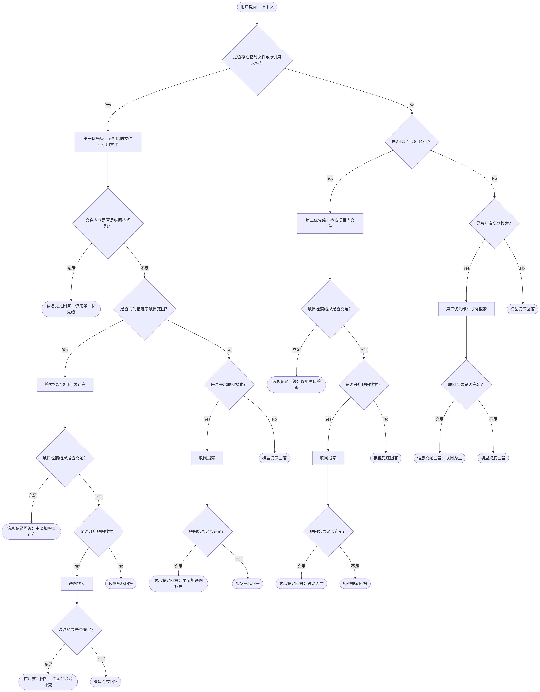
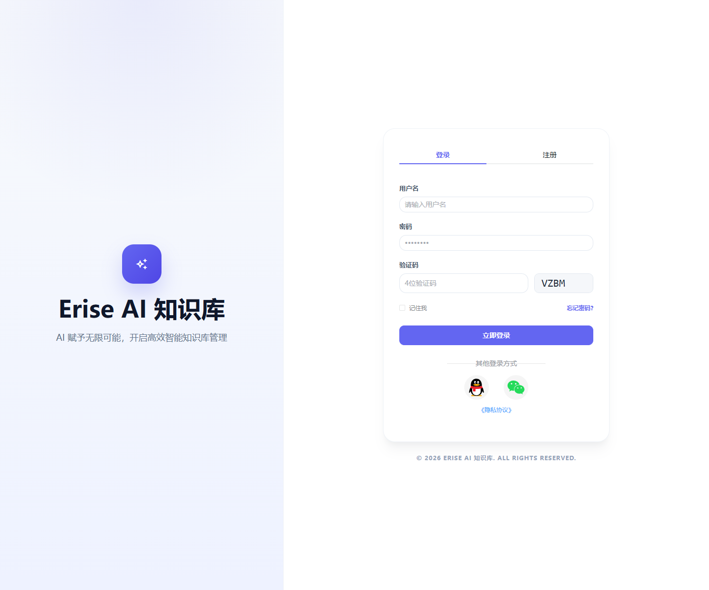
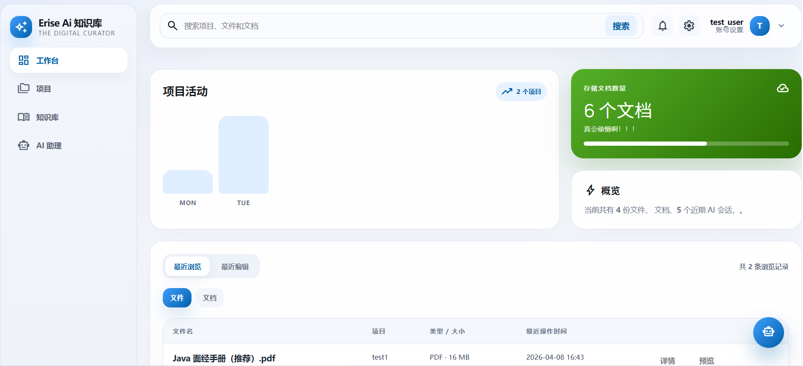
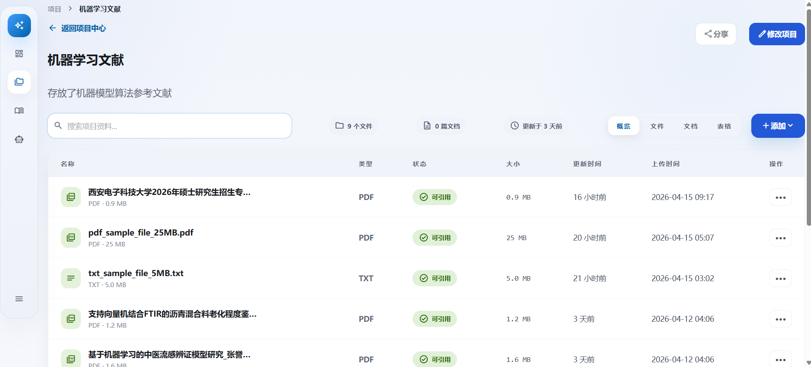
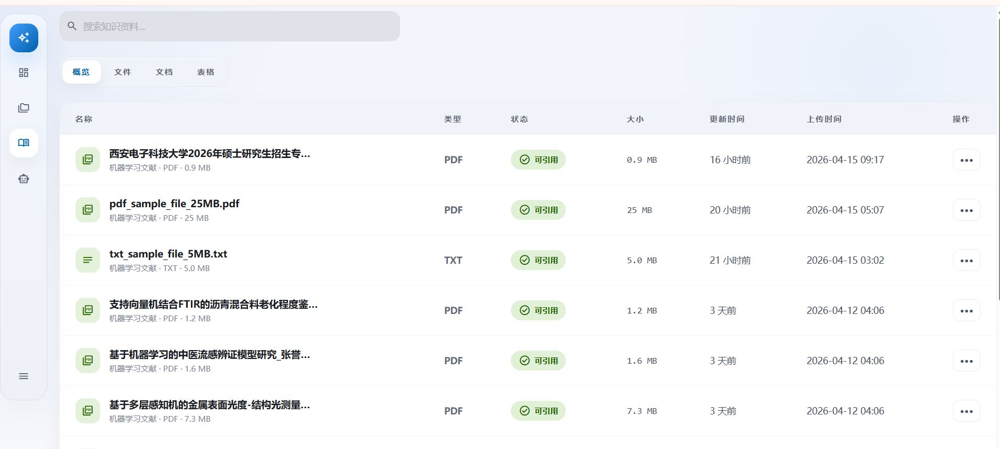
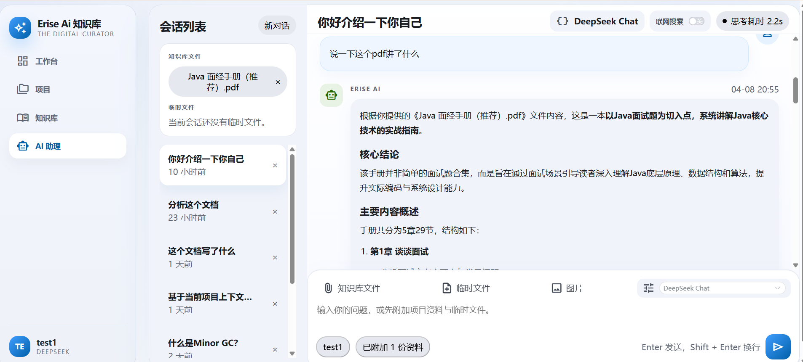
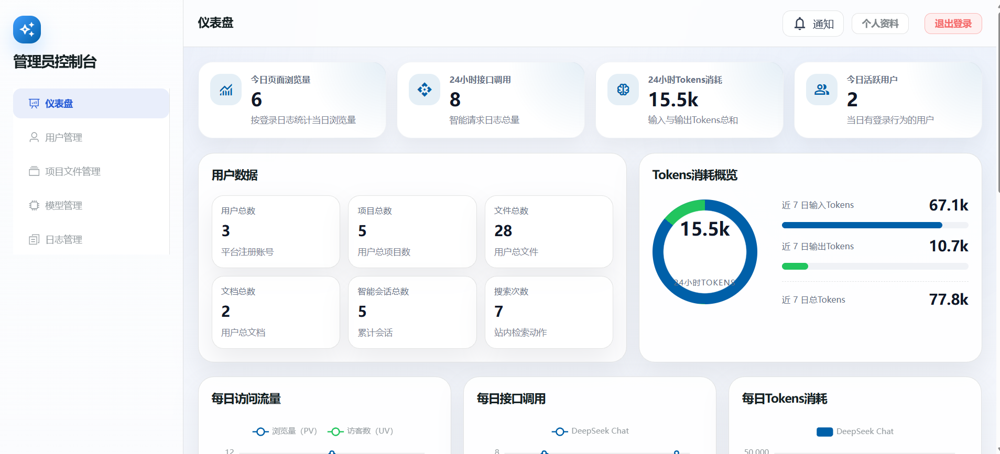

# Erise-AI V1.0

Erise-AI是一个面向个人的轻量项目知识库系统，核心能力覆盖项目文件与文档管理、编辑、统一检索，支持docx、pdf、md、txt文件上传。包括AI/RAG检索能力。

- Ai回答明确区分“指定范围模式”和“通用模式”。指定范围模式禁止越界检索；通用模式必须严格执行“私有知识库→联网搜索（开启状态）→通用知识”三段式降级。
- RAG体系：MySQL业务元数据+MinIO原始文件+Qdrant向量检索
- 采用ofox.ai进行 embedding

## 运行链路

`erise-ai-ui->Nginx->erise-ai-backend->AiAssistant->Model Provider`

其中：

- `erise-ai-ui`：Vue 3 + Vite 前端
- `erise-ai-backend`：JAVA+Spring Boot业务后端与统一网关入口，负责业务数据、项目、文档、文件、MinIO、MySQL、内部接口
- `AiAssistant`：Python AI 聊天、RAG查询、文件解析等功能
- `deploy/nginx`：开发态与部署态Nginx配置

FastAPI
管聊天、RAG查询、embedding、Qdrant、OCR、文件提取
对外暴露/internal/ai/chat/...这类内部接口给Java调用。

## ai回答决策树



## 推荐开发方式

开发态统一使用纯Docker方式启动，本机无需额外安装Java、Node或Python运行环境。

首次使用：

1. 复制 `.env.dev.example` 为 `.env.dev`
2. 按需填写 `OPENAI_API_KEY`、`DEEPSEEK_API_KEY`、`INTERNAL_API_KEY` 等配置
3. 如果要启用联网搜索，请填写：
   - `WEB_SEARCH_PROVIDER=tavily`
   - `TAVILY_API_KEY=<your tavily key>`
   - ！！！不要把 API Key 填到 `WEB_SEARCH_PROVIDER`里
4. 在根目录执行：

```bash
docker compose --env-file .env.dev -f docker-compose.dev.yml up --build
```

停止环境：

```bash
docker compose --env-file .env.dev -f docker-compose.dev.yml down
```

## 开发态访问地址

- Chrome 统一入口：`http://localhost:8088`
- 前端直连调试口：`http://localhost:5173`
- Java Backend 健康检查：`http://localhost:8080/actuator/health`
- Python AI 健康检查：`http://localhost:8081/internal/ai/chat/health`

## 项目主要界面展示

<table>
  <tr>
    <td></td>
    <td></td>
  </tr>
  <tr>
    <td></td>
    <td></td>
    <td></td>
  </tr>
  <tr>
    <td></td>
        <td></td>

  </tr>
</table>

## 生产与其他说明

- 开发态使用：`docker-compose.dev.yml`
- 生产环境仍保留：`docker-compose.yml`
- Nginx 开发态配置文件：`deploy/nginx/default.dev.conf`

## 主要问题说明

1.  长对话会逐渐退化

2.  OCR处理复杂版式文档仍可能不稳

3.  附件上下文有预算上限，长文档容易被截断

### 解析pdf大型文件（25MB）时速度极慢（3min）(修复于4.16)

- 实测 5MBtxt文件ai引用回答需要120s，25MBpdf文件会更长（200s以上​）

#### 部分pdf解析失败（已解决26.4.9）

- 部分pdf解析失败，导致无法被AI助理引用到上下文进行问题回答。后续把 PDF 改成逐页判定、逐页 OCR fallback,并统一 PDF 解析服务，由 Python端 负责

#### 优化索引技术 (已解决26.4.10)

- qdrant向量数据库，需要优化索引技术，考虑混合索引加重排序来提高RAG性能
- 文件的章节识别、切分等处理能力有待提高；文本分块太大导致检索不准，分块太小导致上下文丢失，后续把长文本切成适合模型处理的小块。
